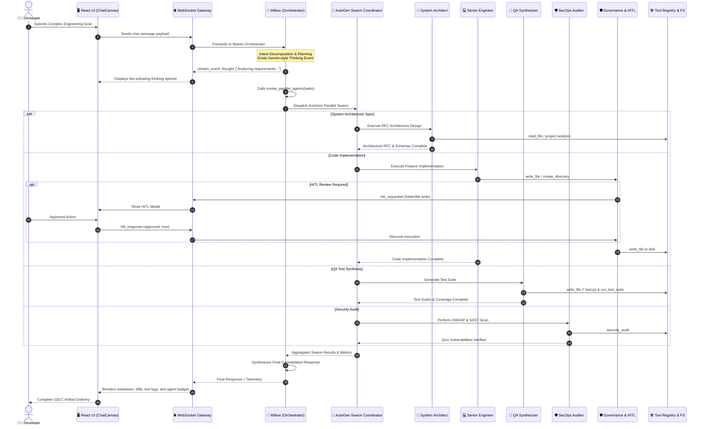

# Enterprise AI Harness Platform for SDLC 🚀

An autonomous and human-in-the-loop **AI Harness Platform for Software Development Life Cycle (SDLC)**, inspired by Google Antigravity, VS Code Studio, and the Model Context Protocol (MCP).

---

## 🌟 Key Highlights & Capabilities
### 1. 🌿 Willow — Master SDLC Orchestrator & General Chat Assistant
- **Central Conversational Assistant**: The developer chats with **Willow** by default. Willow acts as a knowledgeable, general-purpose software engineering partner who answers technical questions, guides discussions, and plans SDLC workflows.
- **Autonomous Agent Delegation**: Willow does not directly perform low-level code editing or execution. Instead, Willow analyzes the user's intent and dynamically invokes specialized agents via the `invoke_agent` tool:
  - 📐 **System Architect & RFC Lead** (`Gemini 2.5 Pro`) — Requirements decomposition, technical design docs (RFCs), API specs, and schemas.
  - 💻 **Full-Stack Senior Engineer** (`Claude 3.7 Sonnet`) — Autonomous pair-programming, multi-file edits, surgical refactoring.
  - 🧪 **QA & Test Synthesizer** (`Gemini 3.8 Flash`) — Automated unit/integration test suites (Vitest/Jest/PyTest) with coverage metrics.
  - 🛡️ **AppSec & Vulnerability Auditor** (`DeepSeek R1`) — OWASP Top 10 SAST scanning, secret leak detection, and CVE remediation.
  - 🚀 **Cloud DevOps & Release SRE** (`OpenAI GPT-4o`) — Dockerfiles, CI/CD pipelines, container orchestration, and rollback plans.
  - 🔍 **Code Reviewer & Quality Gate** (`Gemini 3.8 Flash`) — PR review, style conformity, cyclomatic complexity reduction.
  - 🗄️ **Custom Synthesized Agents** — Any agent created through the conversational agent builder!

### 2. 🤖 Dynamic Agent Hub & "Chat to Create New Agents"
- **Conversational Agent Builder ("Chat-to-Agent")**: Synthesize production-ready SDLC agents simply by typing your requirements in natural language (e.g., *"Build an automated Kubernetes Helm chart & container security auditor with strict review policy and DeepSeek R1"*).

### 2. 🧠 Model Hub & Adaptive Router
- Multi-provider support: **Google Gemini (3.8 Flash, 2.5 Pro)**, **Anthropic Claude (3.7 Sonnet)**, **OpenAI (GPT-4o, o3-mini)**, **DeepSeek (R1, V3)**, and **Local Ollama / vLLM Models**.
- Add / remove / toggle foundation models with custom parameters.
- Token cost tracking ($/million tokens) and latency benchmarking.
- In-memory encrypted API Key configuration manager.

### 3. 🛠️ Tool Registry & Model Context Protocol (MCP)
- **Built-in SDLC Tools**:
  - `read_file`, `write_file`, `replace_file_content` (surgical string patcher)
  - `run_command` (sandboxed terminal runner with timeout protection)
  - `list_directory`, `grep_search` (codebase exploration)
  - `security_audit` (static secret leakage & vulnerability scanner)
  - `run_test_suite` (automated test verification engine)
  - `git_status_diff` (git inspection & diff analyzer)
- **Standard MCP Integration**: Connect stdio and SSE Model Context Protocol servers (GitHub MCP, PostgreSQL MCP, Docker MCP).
- **Sandbox Runner**: Test run any tool directly with custom JSON inputs and inspect return data.

### 4. 🔄 SDLC Multi-Agent Pipelines
- Visual DAG workflows orchestrating multi-agent collaboration:
  - **Full Feature SDLC Lifecycle**: Spec &rarr; Implementation &rarr; Unit Tests &rarr; Security Scan &rarr; PR Sign-off.
  - **Vulnerability Triage & Auto-Patch**: SecOps Audit &rarr; Patch Authoring &rarr; QA Regression Verification.
- Real-time stage execution tracking and handoff telemetry.

### 5. 🛡️ Governance, Sandboxing & Safety Guardrails
- **Autonomy Policies**:
  - `request-review` (Default): Human-in-the-loop pauses on privileged terminal commands or critical file modifications.
  - `always-proceed`: High-velocity autonomous agent execution.
  - `sandbox-strict`: All tool invocations require operator sign-off.
- **Accidental Data Loss Prevention (ADLP)**: Blocks destructive commands (`rm -rf /`, `DROP DATABASE`, disk format) before execution.
- **Live Audit Trail**: Chronological immutable log of all actions, tool calls, and operator approvals.

### 6. 📚 Knowledge Base & Semantic Vector RAG Layer
- **Semantic Vector Store & Ingestion**:
  - Ingests markdown documentation, RFCs, PRDs, code repositories, or custom technical specifications.
  - Smart section & semantic chunker with token boundary overlap.
  - High-dimensional TF-IDF & lexical vector representations with Cosine Similarity ranking.
- **Autonomous RAG Grounding**:
  - Automatically queries the knowledge base when questions or goals are submitted to Willow, injecting relevant context into agent deliberation prompts.
  - Built-in agent tools: `search_knowledge_base` and `ingest_knowledge_document`.
  - Interactive UI Tester: Live query tester with relevance percentage score bars and chunk inspector.

### 7. 🗄️ PostgreSQL Database, Complete Sessions & Versioning Ledger
- **PostgreSQL-Compatible Relational Layer**:
  - Native PostgreSQL driver (`pg`) for live database connections (`DATABASE_URL=postgres://...`) with automatic DDL migrations.
  - Resilient disk-persisted embedded relational fallback (`harness_enterprise_db.json`) for seamless zero-config local runs.
  - Normalized relational schemas for `users`, `sessions`, `messages`, `document_versions`, `knowledge_documents`, and `knowledge_chunks`.
- **Complete Session & Telemetry History**:
  - Full history tracking: role, content, internal thoughts, tool calls, model used, latency (ms), tokens used, and cost ($ USD).
- **Code Versioning & One-Click Rollback**:
  - Automatically captures file snapshots and diffs whenever agents write or patch workspace code.
  - Version timeline (`v1`, `v2`, `v3...`) with authoring agent tags and diff viewer.
  - One-click rollback restores files on disk and records rollback audit logs.
- **Interactive SQL Console**: Test live queries directly in the UI (`SELECT * FROM sessions`, `SELECT * FROM document_versions`).

---

## 🏗️ Architecture

### 1. High-Level Multi-Tier System Architecture

```mermaid
graph TB
    classDef client fill:#1e293b,stroke:#3b82f6,stroke-width:2px,color:#f8fafc;
    classDef gateway fill:#0f172a,stroke:#6366f1,stroke-width:2px,color:#f8fafc;
    classDef orchestrator fill:#064e3b,stroke:#10b981,stroke-width:2px,color:#f8fafc;
    classDef swarm fill:#1e1b4b,stroke:#8b5cf6,stroke-width:2px,color:#f8fafc;
    classDef router fill:#312e81,stroke:#a855f7,stroke-width:2px,color:#f8fafc;
    classDef tools fill:#451a03,stroke:#f59e0b,stroke-width:2px,color:#f8fafc;
    classDef gov fill:#701a75,stroke:#ec4899,stroke-width:2px,color:#f8fafc;
    classDef ext fill:#111827,stroke:#64748b,stroke-width:2px,color:#94a3b8;

    subgraph Tier1["🖥️ TIER 1: Developer Studio UI (React 19 + Vite 8)"]
        ActivityBar["Activity Bar Navigation"]
        ChatCanvas["Gemini-Style Chat Canvas<br/>• Pulsating Thinking Spinner<br/>• History Drawer & New Chat<br/>• Multi-Step Chain of Thought"]
        AgentStudio["Agent Studio & Chat-to-Agent"]
        ModelHubUI["Model Hub & Persistent Vault"]
        ToolsHubUI["Tools & MCP Registry"]
        PipelinesUI["SDLC Multi-Agent Pipelines"]
        HITLModal["HITL Approval & Folder Modal"]
        GovPanel["Governance & Audit Log Panel"]
    end
    class ActivityBar,ChatCanvas,AgentStudio,ModelHubUI,ToolsHubUI,PipelinesUI,HITLModal,GovPanel client;

    subgraph Tier2["🌐 TIER 2: API & Streaming Gateway (Node.js & Express)"]
        RestRouter["REST API Endpoints (/api/*)"]
        WSServer["WebSocket Streaming Gateway<br/>(Realtime Thought, Tools & Swarm Events)"]
        SessionStore["Session & Conversation Store"]
    end
    class RestRouter,WSServer,SessionStore gateway;

    subgraph Tier3["🌿 TIER 3: Master Orchestration Layer (Willow)"]
        Willow["Willow Master SDLC Orchestrator<br/>(Intent Decomposition, Planning & Synthesis)"]
        Delegator["Delegation Dispatcher<br/>• invoke_agent (Sequential)<br/>• invoke_parallel_agents (AutoGen Swarm)"]
    end
    class Willow,Delegator orchestrator;

    subgraph Tier4["🤖 TIER 4: AutoGen Multi-Agent Swarm Runtime"]
        SwarmEngine["AutoGen Swarm Coordinator<br/>(Promise.all Concurrent Dispatch)"]
        subgraph Agents["Specialist Personas"]
            Arch["📐 System Architect (Gemini 2.5 Pro)"]
            Eng["💻 Senior Engineer (Claude 3.7 Sonnet)"]
            QA["🧪 QA Synthesizer (Gemini 3.8 Flash)"]
            Sec["🛡️ SecOps Auditor (DeepSeek R1)"]
            DevOps["🚀 DevOps SRE (OpenAI GPT-4o)"]
            PRRev["🔍 Code Reviewer (Gemini 3.8 Flash)"]
            CustomAgent["🗄️ Custom Synthesized Agents"]
        end
    end
    class SwarmEngine,Arch,Eng,QA,Sec,DevOps,PRRev,CustomAgent swarm;

    subgraph Tier5["🧠 TIER 5: Adaptive Model Router & Provider Adapters"]
        ModelRouter["ModelRouter Dispatcher<br/>(Latency & Cost Tracking)"]
        KeyVault["Persistent Key Vault<br/>(persistedApiKeys.json)"]
        Adapters["Provider Adapters<br/>• Google Gemini<br/>• Anthropic Claude<br/>• OpenAI<br/>• DeepSeek<br/>• Local Ollama / vLLM"]
    end
    class ModelRouter,KeyVault,Adapters router;

    subgraph Tier6["🛡️ TIER 6: Governance, Security & Safety Engine"]
        GovEngine["GovernanceEngine<br/>(always-proceed / request-review / sandbox-strict)"]
        ADLP["ADLP Validator (Catastrophic Prevention)"]
        RepoGuard["Repository Access Boundary"]
        AuditLog["Immutable Audit Log (Live & JSONL)"]
    end
    class GovEngine,ADLP,RepoGuard,AuditLog gov;

    subgraph Tier7["🛠️ TIER 7: Sandboxed Tool Registry & MCP Layer"]
        ToolReg["ToolRegistry<br/>• read_file / write_file<br/>• create_directory / replace_file_content<br/>• run_command / git_status_diff<br/>• search_knowledge_base / ingest_doc<br/>• get_document_versions / rollback"]
        MCPMgr["MCP Manager (Stdio & SSE Connectors)"]
    end
    class ToolReg,MCPMgr tools;

    subgraph Tier8["📚 TIER 8: Knowledge Base & Semantic Vector RAG Engine"]
        RAGEngine["KnowledgeBaseManager<br/>(Semantic Chunking, TF-IDF Embeddings, Cosine Similarity)"]
        VectorStore["Vector Index & Chunk Registry"]
        AutoRAG["Auto-RAG Context Grounder<br/>(Pre-prompt Context Injection for Willow & Swarm)"]
    end
    class RAGEngine,VectorStore,AutoRAG router;

    subgraph Tier9["🗄️ TIER 9: PostgreSQL Database & Versioning Ledger"]
        DBManager["DatabaseManager (Dual-Engine Driver)"]
        PostgresDriver["PostgreSQL Driver (pg.Pool / DATABASE_URL)"]
        EmbeddedFallback["Embedded Relational Fallback (harness_enterprise_db.json)"]
        DBTables["Relational Schemas<br/>• users & sessions<br/>• messages & telemetry<br/>• document_versions & diffs<br/>• knowledge_documents & chunks"]
    end
    class DBManager,PostgresDriver,EmbeddedFallback,DBTables gov;

    subgraph Tier10["🔒 TIER 10: Environment, OS & External Services"]
        Workspace["Repository Workspace (Files & Folders)"]
        Shell["Host Shell / PowerShell / Terminal"]
        GitRepo["Git VCS Repository"]
        ExternalMCP["External MCP Servers (GitHub, Postgres)"]
        FoundationLLMs["Cloud AI Endpoints (Google, Anthropic, OpenAI, DeepSeek)"]
    end
    class Workspace,Shell,GitRepo,ExternalMCP,FoundationLLMs ext;

    Tier1 <-->|REST Calls & WebSockets| Tier2
    Tier2 <--> Tier3
    Tier3 --> Delegator
    Tier3 <--> AutoRAG
    Delegator --> SwarmEngine
    SwarmEngine --> Agents
    Agents <--> ModelRouter
    ModelRouter <--> KeyVault
    ModelRouter --> Adapters
    Adapters <--> FoundationLLMs

    Agents <--> ToolReg
    ToolReg --> GovEngine
    ToolReg <--> RAGEngine
    RAGEngine <--> VectorStore
    ToolReg <--> DBManager
    DBManager --> PostgresDriver & EmbeddedFallback
    DBManager <--> DBTables

    GovEngine --> ADLP & RepoGuard
    GovEngine -.->|HITL Interrupt Event| WSServer
    WSServer -.->|Approval Prompt| HITLModal
    HITLModal -.->|Approve or Deny| WSServer
    WSServer -.->|Resume Execution| GovEngine
    GovEngine --> AuditLog

    ToolReg <--> Workspace & Shell & GitRepo
    ToolReg <--> MCPMgr
    MCPMgr <--> ExternalMCP
```


### 2. AutoGen Multi-Agent Swarm Orchestration Flow


### 3. Human-in-the-Loop (HITL) & Governance Flow
```mermaid
flowchart TD
    A[Agent requests Tool Execution] --> B{Is Tool Privileged?}
    B -- No (read_file, grep_search) --> C[Direct Execution]
    B -- Yes (write_file, create_directory, run_command) --> D[Check Governance Engine Policy]
    D --> E{Active Policy}
    E -- always-proceed --> F[Run ADLP Validator]
    E -- sandbox-strict --> G[Always Intercept for HITL]
    E -- request-review --> H{Is Workspace Authorized?}
    H -- No --> I[Trigger Repository Authorization Modal]
    I --> J{User Decision}
    J -- Denied --> K[Reject Tool & Log Denial]
    J -- Granted --> F
    H -- Yes --> F
    F --> L{ADLP Check Passed?<br/>No rm -rf / DROP TABLE}
    L -- Failed --> M[Block Immediately & Alert Admin]
    L -- Passed --> N{Action requires HITL Approval?}
    N -- No --> C
    N -- Yes --> G
    G --> O[Emit WebSocket 'hitl_requested']
    O --> P[Pause Agent Execution (Pending Promise)]
    P --> Q[Display Interactive Modal in React UI]
    Q --> R{Operator Action}
    R -- Click Approve --> S[Resolve Promise: Approved]
    R -- Click Reject --> T[Resolve Promise: Rejected]
    S --> U[Execute Tool on Host Environment]
    T --> K
    U --> V[Record Cryptographic Audit Entry]
    K --> V
    V --> W[Stream Status to Client]
```

---

## 🚀 Getting Started

### Prerequisites
- **Node.js**: v18.0.0+ (Tested on v24.13.0)
- **npm**: v9.0.0+

### Starting the Platform

1. **Install dependencies** (if not already done):
   ```bash
   npm install
   cd client && npm install && cd ..
   ```

2. **Start the Harness Platform**:
   ```bash
   node server/src/index.js
   ```
   The platform will start on **`http://localhost:4000`** with the built client UI, REST API, and WebSocket streaming server all active.

3. **Or run with Vite Hot-Module Replacement (HMR)**:
   ```bash
   # Terminal 1: Backend
   node server/src/index.js

   # Terminal 2: Frontend with HMR
   cd client && npm run dev
   ```
   Open `http://localhost:3000` in your browser.

---

## 📖 SDLC Workflows Walkthrough

### 1. Chat & Pair Program with Willow (with Gemini-Style Chat History)
- Open the **Agent Studio & Pair Chat** tab.
- **Chat History Sidebar (Gemini-style)**:
  - Collapsible left panel indexing recent conversations with relative timestamps (`Just now`, `5m ago`).
  - Click **+ New chat** to instantly start a fresh session with Willow.
  - Switch between active and historical conversations anytime or delete old threads.
- Chat with **Willow** (Master SDLC Orchestrator) or select a direct specialist override from the dropdown.
- Expand the **Chain of Thought & Agent Reasoning** box to inspect the agent's internal deliberation before tool actions are taken.

### 2. Synthesize a New Agent via Chat
- Click on **Agent Hub & Creator** in the activity bar.
- Switch to the **Chat to Create Agent** tab.
- Enter your prompt: e.g. `"Create an automated database migration and Prisma schema optimization engineer"`.
- Review the synthesized agent card: Role, Model, Policy, System Prompt, and Tool permissions.
- Click **Add to Harness Registry** to deploy the agent into your harness.

### 3. Manage Models, API Keys & Test Connections
- **Model Hub**: Enable/disable models, add local Ollama models, and inspect token pricing.
- **Persistent API Keys**:
  - Saved keys are persisted to `server/src/data/persistedApiKeys.json` and remain active across engine restarts unless you explicitly change or delete them.
  - Delete or clear saved keys anytime via the **Delete Key** button in the configuration modal.
- **Testing Model Connectivity**:
  - **In the UI**: Click **Configure API Keys** and press **Test Connection** to execute a live handshake with latency telemetry. Or click **Test Connection** directly on any model card in the grid!
  - **Via API / Terminal**: Send a `POST http://localhost:4000/api/models/test-connection` with `{ "provider": "google" }` or inspect `GET http://localhost:4000/api/models/keys/status`.
- **Tools & MCP Hub (including Human-in-the-Loop Directory Creation)**:
  - Connect external MCP servers (GitHub, Postgres, Docker), add custom tools with JSONSchema, or test run tools live in the sandbox.
  - **Folder/Directory Creation with HITL**: The harness includes the built-in `create_directory` tool. Whenever an agent creates a folder, the **Human-in-the-Loop Approval Modal** intercepts the operation, displaying the folder path and recursive options for your review before disk changes are applied.

### 4. Run Multi-Agent Pipelines
- Open **SDLC Multi-Agent Pipelines**.
- Select the **Full Feature SDLC Lifecycle** or **Vulnerability Triage & Auto-Patch**.
- Enter your goal and click **Execute Full Pipeline** to watch agents hand off context sequentially across stages!
